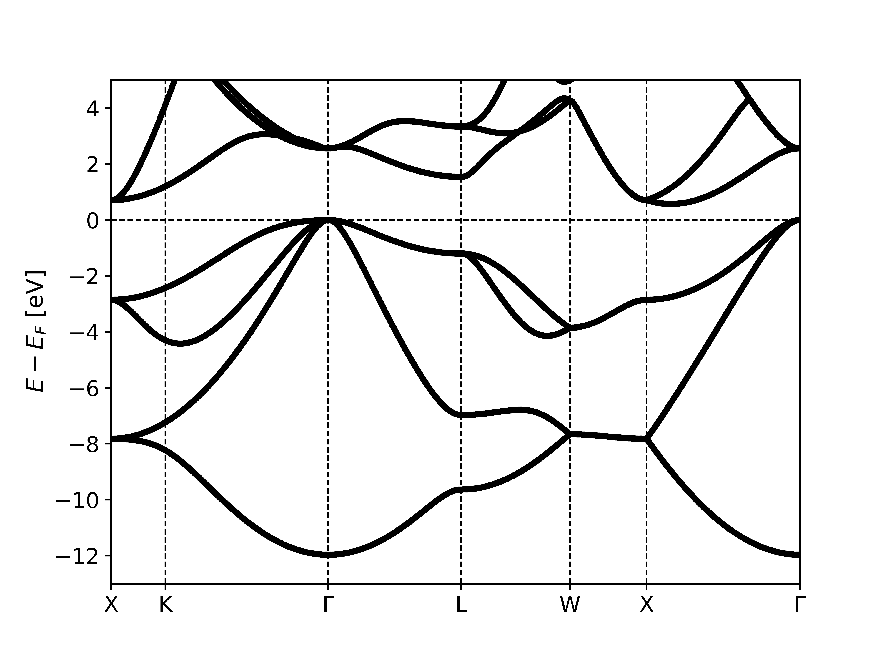
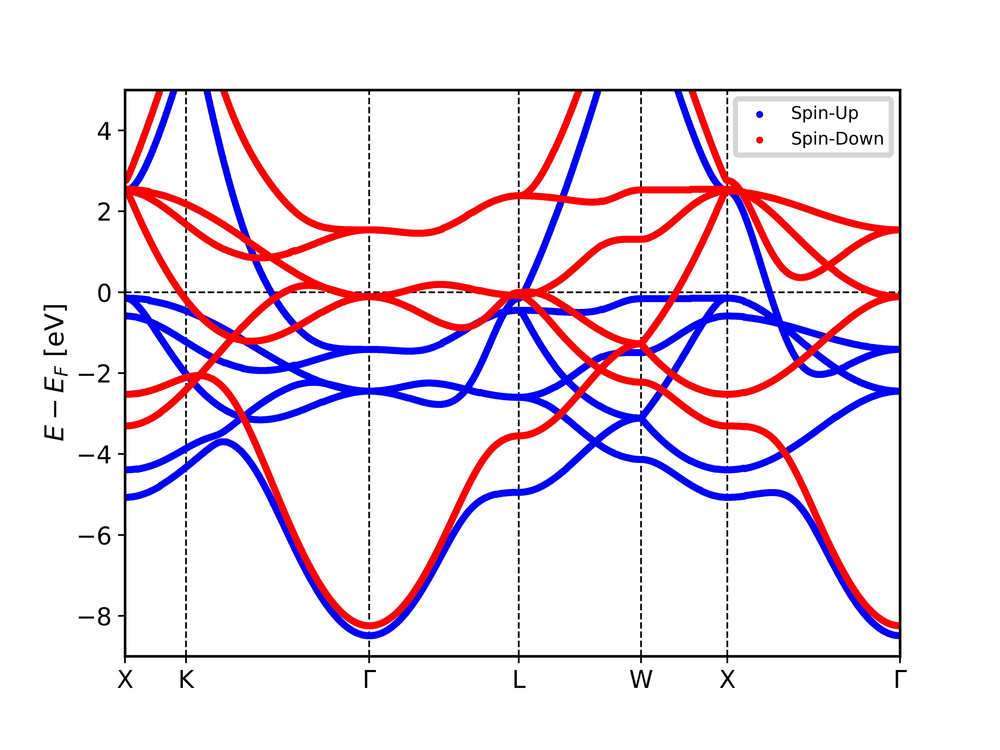
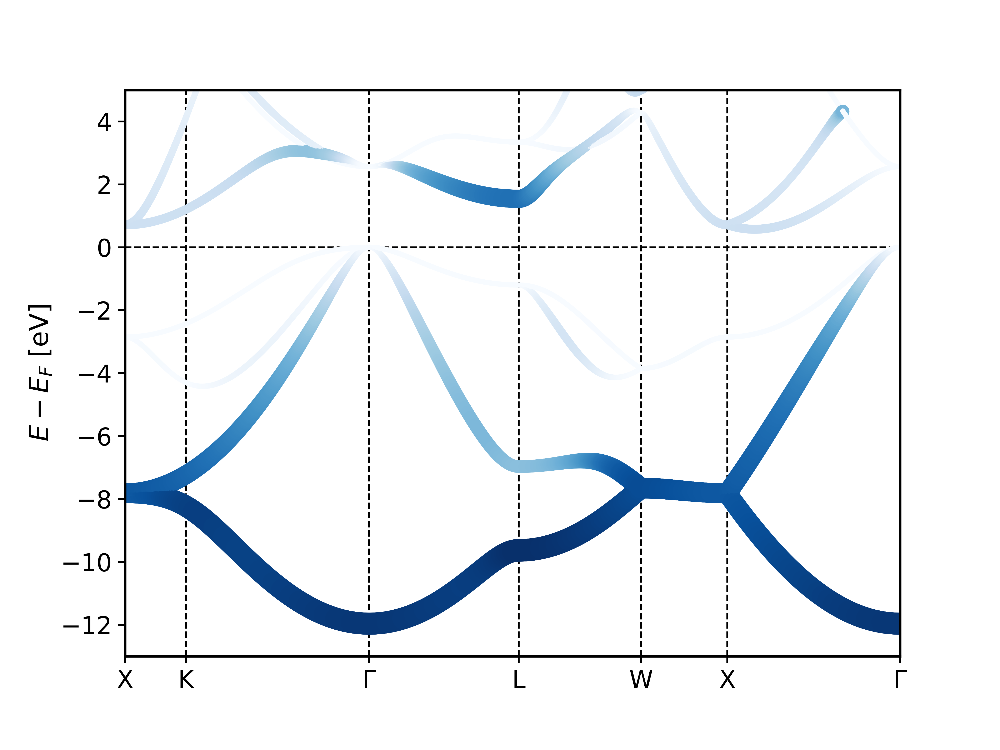
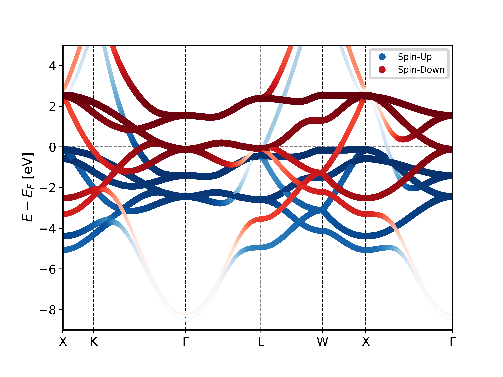
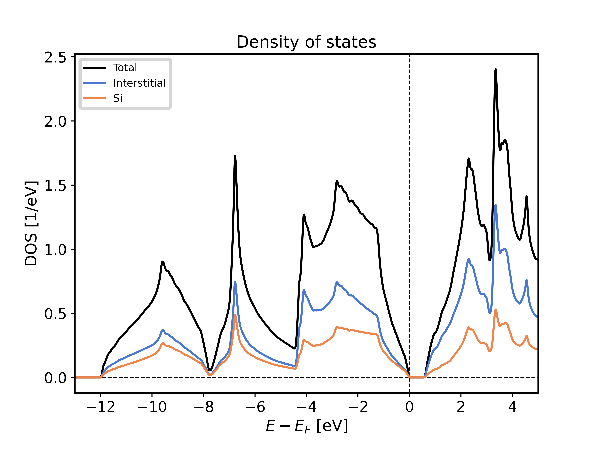
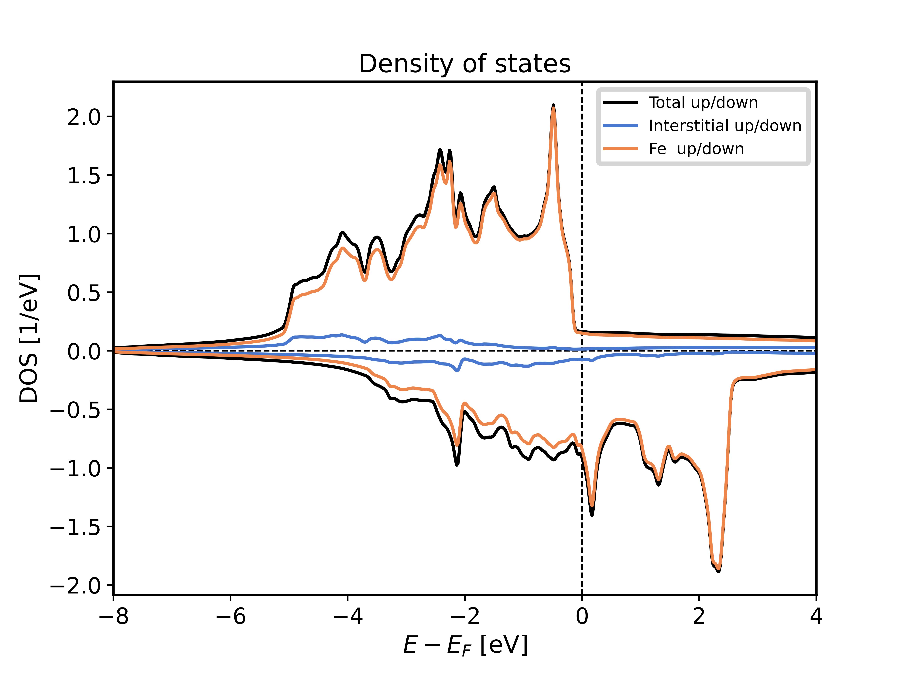
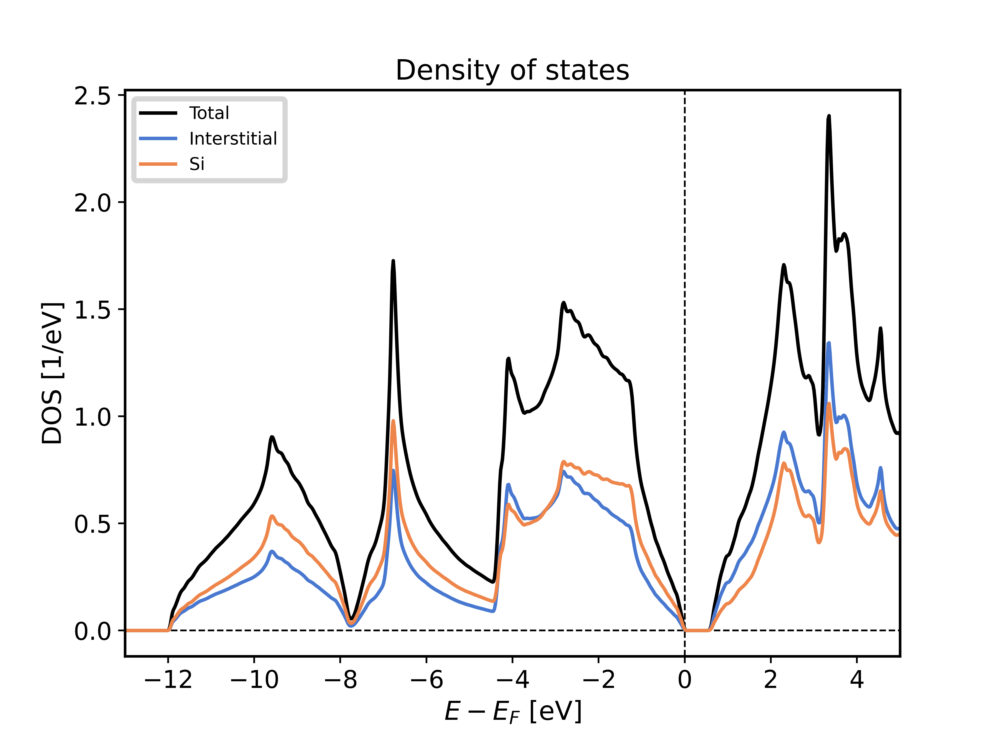
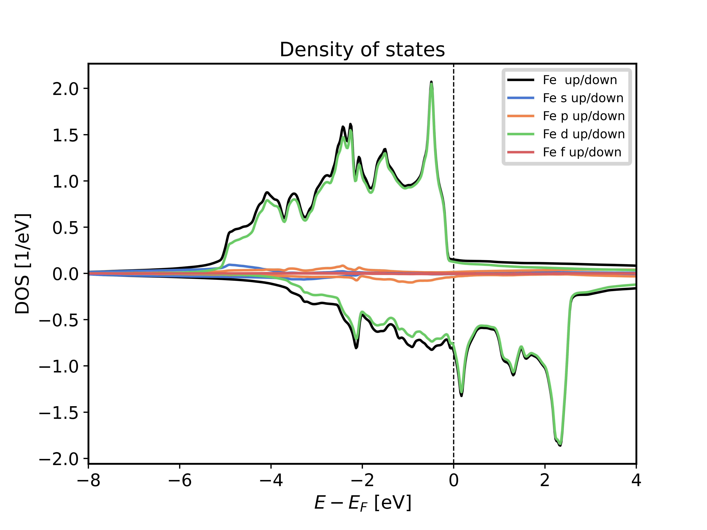

Plotting Fleur DOS/bandstructures
++++++++++++++++++++++++++++++++++

This section discusses how to obtain plots of data in the ``banddos.hdf`` for density of states and bandstructure calculations.

The process here is divided in two parts. First we extract and transform the data in a way to make it easy to plot via the :py:class:`~masci_tools.io.parsers.hdf5.reader.HDF5Reader`. For a detailed explanation of the capabilities of this tool refer to :ref:`hdf5_parser`. Here we show the basic usage:

.. code-block:: python

   #Example: Bandstructure calculation

   from masci_tools.io.parsers.hdf5 import HDF5Reader
   from masci_tools.io.parsers.hdf5.recipes import FleurBands

   with HDF5Reader('/path/to/banddos.hdf') as h5reader:
      data, attributes = h5reader.read(recipe=FleurBands)

In the following bandstructure and DOS plots are explained. Each section leads with the names of the recipes from the :py:mod:`~masci_tools.io.parsers.hdf5.recipes` module that can be used with the explained visualization function.

All Fleur specific plotting routines are found in :py:mod:`~masci_tools.vis.fleur` have implementations for both the matplotlib and bokeh plotting libraries and can be customized heavily. For an explanation on customizing plots refer to :ref:`plotting`.

Bandstructures
---------------

Compatible Recipes: ``FleurBands``

The bandstructure visualization :py:func:`~masci_tools.vis.fleur.plot_fleur_bands()` can be used to plot

   1. Non-spinpolarized/spinpolarized bandstructures
   2. Bandstructures with emphasized weights on all eigenvalues (Also non-spinpolarized and spinpolarized)

Standard bandstructure
^^^^^^^^^^^^^^^^^^^^^^^^

To plot a simple bandstructure without any weighting we just have to pass the data, that the :py:class:`~masci_tools.io.parsers.hdf5.reader.HDF5Reader` provided to the :py:func:`~masci_tools.vis.fleur.plot_fleur_bands()`

The two exmaples below show the resulting plots for a non-psinpolarized system (bulk Si) and a spin-polarized system (Fe fcc). For both systems the necessary code is exactly the same and is shown above the plots. The shown plots are the ones for the matplotlib plotting backend:

.. code-block:: python

   from masci_tools.io.parsers.hdf5 import HDF5Reader
   from masci_tools.io.parsers.hdf5.recipes import FleurBands
   from masci_tools.vis.fleur import plot_fleur_bands

   #Read in data
   with HDF5Reader('/path/to/banddos.hdf') as h5reader:
      data, attributes = h5reader.read(recipe=FleurBands)

   #Plot the data
   #Notice that you get the axis object of this plot is returned
   #if you want to make any special additions
   ax = plot_fleur_bands(data, attributes)

Non spinpolarized bandstructure
""""""""""""""""""""""""""""""""

Spinpolarized bandstructure
""""""""""""""""""""""""""""""""

Bandstructure with weights
^^^^^^^^^^^^^^^^^^^^^^^^^^^

To plot a simple bandstructure with weighting we do the same procedure as above, but we pass in the entry we want to use for weights. These correspond to the entries in the ``banddos.hdf`` file (for example the weight for the s-orbital on the first atom type is called ``MT:1s``)

The weights will be used to change the size and color (according to a colormap) to indicate regions of high weight.

The two exmaples below show the resulting plots for a non-psinpolarized system (bulk Si) weighted for the s-orbital on the first atom and a spin-polarized system (Fe fcc) with weights for the d-orbital on the first atom type. For both systems the necessary code is exactly the same and is shown above the plots. The shown plots are the ones for the matplotlib plotting backend:

.. code-block:: python

   from masci_tools.io.parsers.hdf5 import HDF5Reader
   from masci_tools.io.parsers.hdf5.recipes import FleurBands
   from masci_tools.vis.fleur import plot_fleur_bands

   #Read in data
   with HDF5Reader('/path/to/banddos.hdf') as h5reader:
      data, attributes = h5reader.read(recipe=FleurBands)

   #Plot the data
   #Notice that you get the axis object of this plot is returned
   #if you want to make any special additions
   ax = plot_fleur_bands(data, attributes, weight='MT:1s')

Non spinpolarized bandstructure (weights for s-orbital)
""""""""""""""""""""""""""""""""""""""""""""""""""""""""

Spinpolarized bandstructure (weights for d-orbital)
""""""""""""""""""""""""""""""""""""""""""""""""""""

Density of States
------------------

Compatible Recipes: ``FleurDOS``, ``FleurJDOS``, ``FleurORBCOMP``, ``FleurMCD``

The dos visualization :py:func:`~masci_tools.vis.fleur.plot_fleur_dos()` can be used to plot
non spinpolarized and spinpolarized DOS, with selection of which components to plot.

Standard density of states plot
^^^^^^^^^^^^^^^^^^^^^^^^^^^^^^^^

.. code-block:: python

   from masci_tools.io.parsers.hdf5 import HDF5Reader
   from masci_tools.io.parsers.hdf5.recipes import FleurDOS
   from masci_tools.vis.fleur import plot_fleur_dos

   #Read in data
   with HDF5Reader('/path/to/banddos.hdf') as h5reader:
      data, attributes = h5reader.read(recipe=FleurDOS)

   #Plot the data
   #Notice that you get the axis object of this plot is returned
   #if you want to make any special additions
   ax = plot_fleur_dos(data, attributes)

Non spinpolarized DOS
""""""""""""""""""""""

Spinpolarized DOS
""""""""""""""""""""""

Plotting options for DOS plots
^^^^^^^^^^^^^^^^^^^^^^^^^^^^^^^^

The :py:func:`~masci_tools.vis.fleur.plot_fleur_dos()` function has a couple of options to modify, what is being displayed from the ``banddos.hdf`` file. Below we show a few examples of ways to use these options, together with examples of resulting plots.

DOS with atom components scaled with equivalent atoms
""""""""""""""""""""""""""""""""""""""""""""""""""""""

When you look at the example plot for the non spin-polarized DOS, you might notice that the interstitial component and the atom projected components do not add up to the total density of states. This system has two symmetry equivalent `Si` atoms. By default the atom projected density of states corresponds to only one of these atoms.

If you wish to show the atom projected components of the DOS scaled with the number of symmetry equivalent atoms you can provide the option ``multiply_by_equiv_atoms=True`` option to the plotting function.

.. code-block:: python

   ax = plot_fleur_dos(data, attributes, multiply_by_equiv_atoms=True)

Selecting specific DOS components
""""""""""""""""""""""""""""""""""

The DOS is made up of a lot of contributions that can be displayed separately.

Here we list the options that are available and show exmaple plots for only selecting the atom projected compinents of the density of states

   - :plot_keys: Can be used to provide a explicit list of keys you want to display (Same format as in the ``banddos.hdf``)
   - :show_total: Control, whether to show the total density of states (default ``True``)
   - :show_interstitial: Control, whether to show the interstitial contribution of the density of states (default ``True``)
   - :show_atoms: Control, which total atom projected DOS to show. Can be either the string ``all`` (All components are shown), the value ``None`` (no components are shown) or a list of the integer indices of the atom types that should be displayed (default ``all``)
   - :show_lresolved: Control, on which atoms to show the orbital projected DOS. Can be either the string ``all`` (All components are shown), the value ``None`` (no components are shown) or a list of the integer indices of the atom types for which to display the orbital components (default ``None``)

Below an example of only displaying the atom projected DOS together with their orbital contributions is shown.

.. code-block:: python

   ax = plot_fleur_dos(data, attributes,
                       show_total=False,
                       show_interstitial=False,
                       show_lresolved='all')

.. image:: ../images/dos_non_spinpol_selection.png
    :width: 100%
    :align: center

