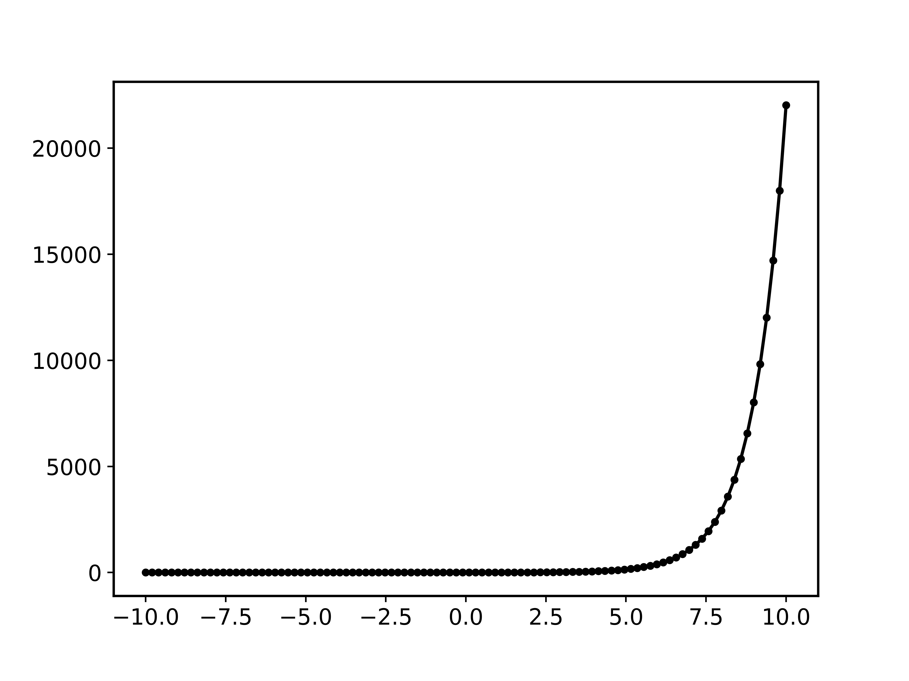
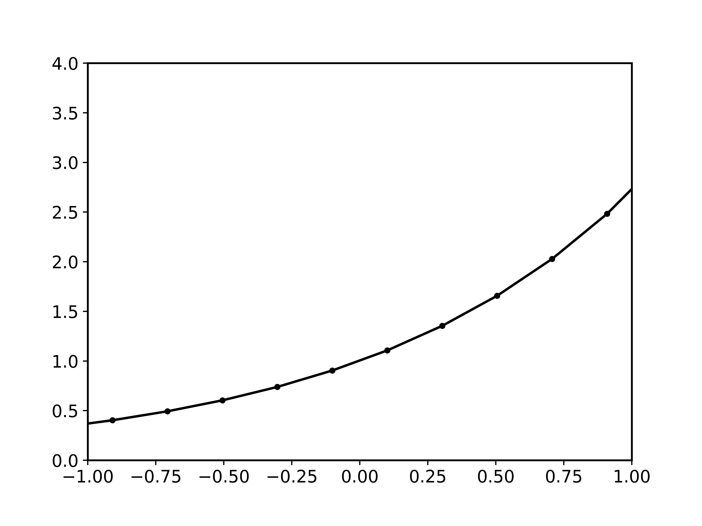
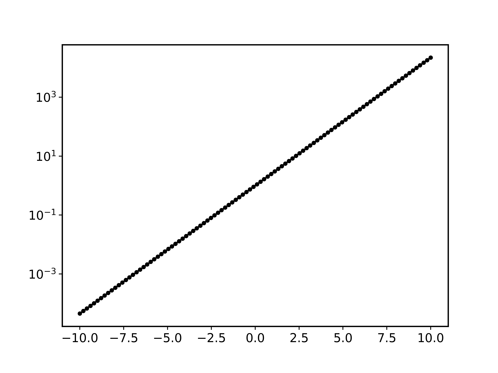
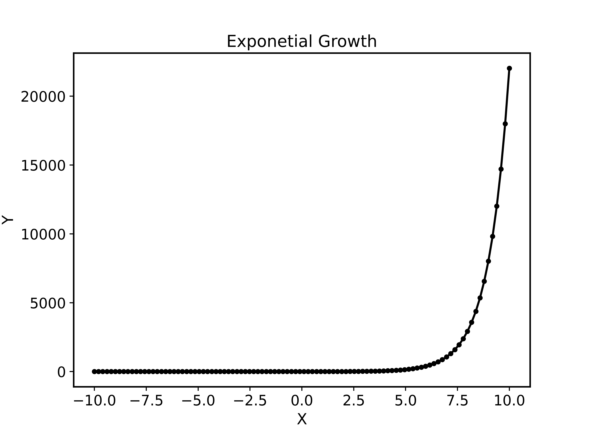
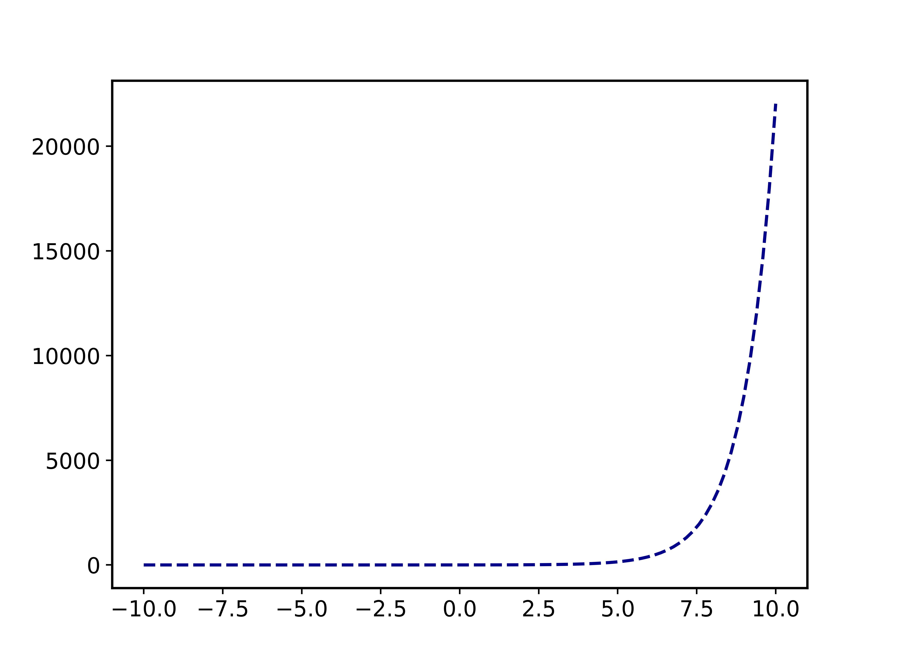
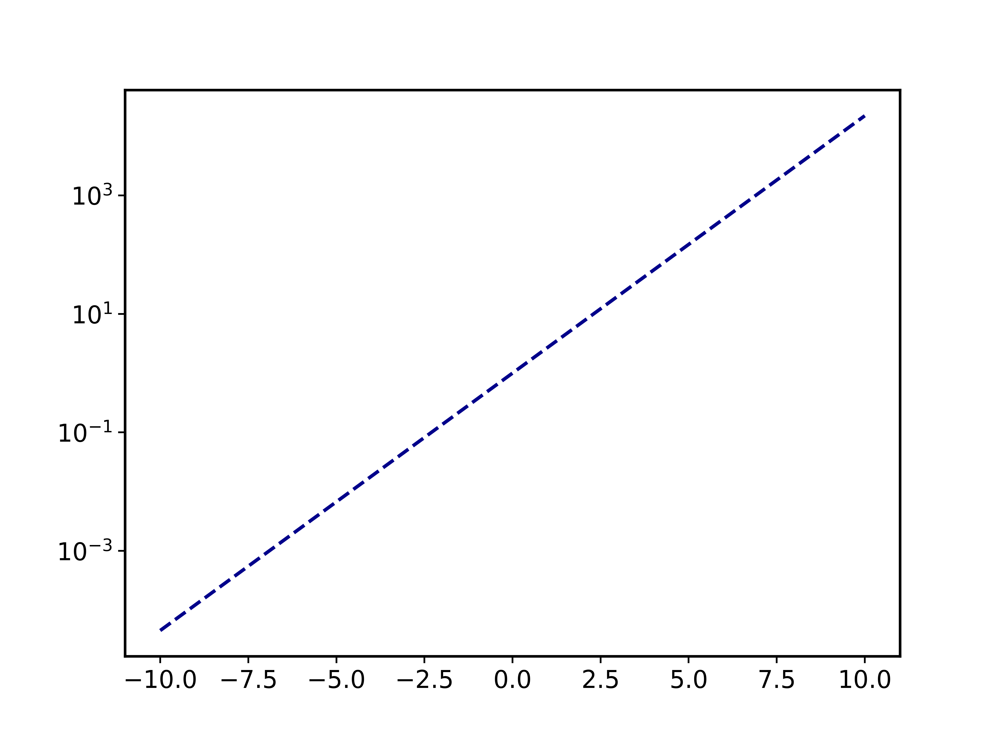
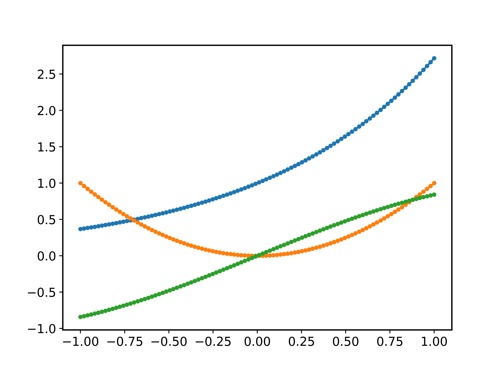
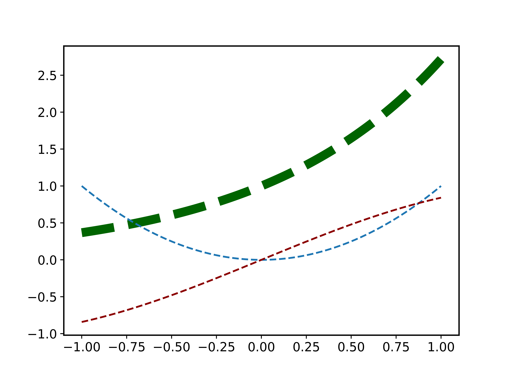

.. _plotting:

General Plotting routines
++++++++++++++++++++++++++

.. _matplotlib: https://matplotlib.org/stable/index.html
.. _bokeh: https://docs.bokeh.org/en/latest/index.html

The plotting of data is always a common task that needs to be performed. However, there is a lot of variation in how someone might want plots to look or be arranged. Some plots might also need to be interactive to be of a real use.

For these reasons the ``masci_tools`` library provides utility for general plotting and template functions for common plots made wehn working with DFT methods. There are two plotting backends available:

   - :`matplotlib`_: Mainly used for non-interactive plots
   - :`bokeh`_: Mainly used for interactive plots

Available Routines
-------------------

For both of these there are a lot of plotting routines available (both general or specific to a problem). All of these routines will return the used ``Axes`` object in the case of matplotlib or the ``figure`` produced by bokeh for custom modifications.

   - `matplotlib`:
      - :py:func:`~masci_tools.vis.plot_methods.single_scatterplot()`: Make a scatterplot with lines for a single set of data
      - :py:func:`~masci_tools.vis.plot_methods.multiple_scatterplots()`: Make a scatterplot with lines for multiple sets of data
      - :py:func:`~masci_tools.vis.plot_methods.multi_scatter_plot()`: Make a scatterplot with varying size and color fo the points for multiple sets of data
      - :py:func:`~masci_tools.vis.plot_methods.colormesh_plot()`: Make 2D plot with the data represented as color
      - :py:func:`~masci_tools.vis.plot_methods.waterfall_plot()`: Make 3D plot with the `scatter3D` function of matplotlib
      - :py:func:`~masci_tools.vis.plot_methods.surface_plot()`: Make 3D plot with the `plot_surface` function of matplotlib
      - :py:func:`~masci_tools.vis.plot_methods.multiplot_moved()`: Plot multiple sets of data above each other with a configurable shift
      - :py:func:`~masci_tools.vis.plot_methods.histogram()`: Make a histogram plot
      - :py:func:`~masci_tools.vis.plot_methods.barchart()`: Make a barchart plot
      - :py:func:`~masci_tools.vis.plot_methods.multiaxis_scatterplot()`: Make a plot containing multiple sets of data distributed over multiple subplots in a grid
      - :py:func:`~masci_tools.vis.plot_methods.plot_convex_hull2d()`: Make a 2D plot of a convex hull
      - :py:func:`~masci_tools.vis.plot_methods.plot_residuen()`: Make a residual plot for given real and fit data. Can also produce a histogram of the deviations
      - :py:func:`~masci_tools.vis.plot_methods.plot_convergence_results()`: Plot the convergence behaviour of charge density distances and energies of a single calculation
      - :py:func:`~masci_tools.vis.plot_methods.plot_convergence_results_m()`: Plot the convergence behaviour of charge density distances and energies of multiple calculations
      - :py:func:`~masci_tools.vis.plot_methods.plot_lattice_constant()`: Plot the energy curve with changing unit cell volume
      - :py:func:`~masci_tools.vis.plot_methods.plot_dos()`: Plot a general density of states (non-spinpolarized)
      - :py:func:`~masci_tools.vis.plot_methods.plot_spinpol_dos()`: Plot a general density of states (spinpolarized)
      - :py:func:`~masci_tools.vis.plot_methods.plot_bands()`: Plot a general bandstructure (non-spinpolarized)
      - :py:func:`~masci_tools.vis.plot_methods.plot_spinpol_bands()`: Plot a general bandstructure (spinpolarized)
   - `bokeh`:
      - :py:func:`~masci_tools.vis.bokeh_plots.bokeh_scatter()`: Make a scatterplot for a single set of data
      - :py:func:`~masci_tools.vis.bokeh_plots.bokeh_multi_scatter()`: Make a scatterplot for a multiple sets of data
      - :py:func:`~masci_tools.vis.bokeh_plots.bokeh_line()`: Make a line plot for multiple sets of data
      - :py:func:`~masci_tools.vis.bokeh_plots.bokeh_dos()`: Plot a general density of states (non-spinpolarized)
      - :py:func:`~masci_tools.vis.bokeh_plots.bokeh_spinpol_dos()`: Plot a general density of states (spinpolarized)
      - :py:func:`~masci_tools.vis.bokeh_plots.bokeh_bands()`: Plot a general bandstructure (non-spinpolarized)
      - :py:func:`~masci_tools.vis.bokeh_plots.bokeh_spinpol_bands()`: Plot a general bandstructure (spinpolarized)
      - :py:func:`~masci_tools.vis.bokeh_plots.periodic_table_plot()`: Make a interactive plot of data for the periodic table

If you have ideas for new useful and beatiful plotting routines you are welcome to contribute. Refer to the section :ref:`devguideplotting` for a guide on how to get started.

Customizing Plots
------------------

You might want to change the parameters of your plot. From changing the color, linestyle or shape of the markers there are a million options to tweak.

These can be set by simply passing the keyword arguments with the desired parameters to the plotting function. The names of these parameters mostly correspond to the same names as in the plotting library that is used in the plotting function. However, there are some deviations and also some special keywords that you can use. We will go over the most important ones in this section accompanied with concrete code examples. For a reference of the defaults defined in the ``masci_tools`` library you can refer to :py:class:`~masci_tools.vis.matplotlib_plotter.MatplotlibPlotter` and :py:class:`~masci_tools.vis.bokeh_plotter.BokehPlotter` for a complete reference.

The most important special keywords are listed below. If there are deviating names for these in ``matplotlib`` and ``bokeh`` plotting functions both names are written in the order ``matplotlib or bokeh``:

   - :limits: This is used to set the bounds of the axis specifically. Provided in form of a dictionary. For example passing ``limits={'x': (-5,5)}`` will set the x-axis limits between ``-5`` and ``5`` and ``limits={'x': (-5,5), 'y':(0,10)}`` will set the y-axis limits in addition
   - :scale: Used to set the scaling of the axis in the plots. Also provided in form of a dictionary. For example passing ``scale={'x': 'log', 'y': 'log'}`` will set both axis to logarithmic scaling ``scale={'y': 'log'}`` will only to it for the y-axis
   - :lines or straight_lines: Easy way to draw help lines into the plot. Provided in form of a dictionary. For example passing ``lines={'vertical': 0}`` will draw a vertical line at ``x=0`` ``lines={'horizontal': [1,5,10]}`` will draw three horizontal lines at ``y=1, 5 or 10`` respectively
   - :plot_labels or legend_labels: Defines labels for the legend of a plot
   - :labels for axis: Normally called ``xlabel`` or ``ylabel``, but specialized plot routines might have different names
   - :title: Title for the produced plot
   - :saving options: ``show=True`` call the plotting library specific show routines (default). For matplotlib you can also specify ``saveas='filename'`` and ``save_plots=True`` to save the plot to file

In the following we will look at examples using the matplotlib plotting functions in :py:mod:`~masci_tools.vis.plot_methods`. The options are the same for the bokeh plotting routines in :py:mod:`~masci_tools.vis.bokeh_plots`.

Single plots
^^^^^^^^^^^^^

We start from the default result of calling the :py:func:`~masci_tools.vis.plot_methods.single_scatterplot()` function with an exponential function. Afterwards we go through examples of modifying this call in one particular way. All of these can be combined to customize the plot to your desire

.. code-block:: python

   from masci_tools.vis.plot_methods import single_scatterplot
   import numpy as np

   x = np.linspace(-10, 10, 100)
   y = np.exp(x)

   ax = single_scatterplot(x,y)

Setting limits
""""""""""""""""

.. code-block:: python

   from masci_tools.vis.plot_methods import single_scatterplot
   import numpy as np

   x = np.linspace(-10, 10, 100)
   y = np.exp(x)

   ax = single_scatterplot(x,y, limits={'x': (-1,1), 'y': (0,4)})

Modifying the scale of the axis
"""""""""""""""""""""""""""""""""

.. code-block:: python

   from masci_tools.vis.plot_methods import single_scatterplot
   import numpy as np

   x = np.linspace(-10, 10, 100)
   y = np.exp(x)

   ax = single_scatterplot(x,y, scale={'y': 'log'})

Setting labels on the axis and a title
"""""""""""""""""""""""""""""""""""""""

.. code-block:: python

   from masci_tools.vis.plot_methods import single_scatterplot
   import numpy as np

   x = np.linspace(-10, 10, 100)
   y = np.exp(x)

   ax = single_scatterplot(x,y, xlabel='X', ylabel='Y', title='Exponential Growth')

Modifying plot parameters
""""""""""""""""""""""""""

See the `matplotlib`_ documentation for complete references of possible options

.. code-block:: python

   from masci_tools.vis.plot_methods import single_scatterplot
   import numpy as np

   x = np.linspace(-10, 10, 100)
   y = np.exp(x)

   ax = single_scatterplot(x,y, color='darkblue', linestyle='--', marker=None)

Setting user defaults
^^^^^^^^^^^^^^^^^^^^^^

If you wish to change some parameters for all the plots you want to do, you can use the functions :py:func:`~masci_tools.vis.plot_methods.set_mpl_plot_defaults()` or :py:func:`~masci_tools.vis.bokeh_plots.set_bokeh_plot_defaults()` for the matplotlib and bokeh plotting library respectively. These functions accept the same keyword arguments as above and they will be applied to all the next plots that you do.

You can reset the changes to the defaults with :py:func:`~masci_tools.vis.plot_methods.reset_mpl_plot_defaults()` or :py:func:`~masci_tools.vis.bokeh_plots.reset_bokeh_plot_defaults()`

.. note::
   You can still override these defaults by simply passing in another value for the parameter you wish to overwrite in the call to a plotting function

.. code-block:: python

   from masci_tools.vis.plot_methods import single_scatterplot, set_mpl_plot_defaults
   import numpy as np

   x = np.linspace(-10, 10, 100)
   y = np.exp(x)

   set_mpl_plot_defaults(color='darkblue', linestyle='--', marker=None)

   ax = single_scatterplot(x,y, scale={'y': 'log'})

Multiple plots
^^^^^^^^^^^^^^^

Many plotting routines accept multiple sets of data to plot. An example of this is the :py:func:`~masci_tools.vis.plot_methods.multiple_scatterplots()` function. The usage of these is essentially the same. However, some parameters can be changed for each data set to plot. These include but are not limited to ``linestyle``, ``linewidth``, ``marker``, ``markersize`` and ``color``. These parameters can either be set to a single value applying it to all data sets, or can be specified for some/all data sets with unspecified values being replaced with the current defaults. This second way can be done in two ways (Both of the below examples have the same effect):

   1. List of values (``None`` for unspecified values) Example: ``linestyle=['-', None, '--']``
   2. Dictionary with integer indices Example: ``linestyle={0:'-', 2:'--'}``

.. warning::
   Specifying parameters for multiple data sets is only valid for the parameters passed into the function. Setting defaults with values for multiple data sets is not supported

Default plot
"""""""""""""
.. code-block:: python

   from masci_tools.vis.plot_methods import multiple_scatterplots
   import numpy as np

   x = np.linspace(-1,1,100)
   y = np.exp(x)
   y2 = x**2
   y3 = np.sin(x)

   ax = multiple_scatterplots([x, x, x], [y, y2, y3])

Changing parameters on all plots
""""""""""""""""""""""""""""""""""""""""
.. code-block:: python

   from masci_tools.vis.plot_methods import multiple_scatterplots
   import numpy as np

   x = np.linspace(-1,1,100)
   y = np.exp(x)
   y2 = x**2
   y3 = np.sin(x)

   ax = multiple_scatterplots([x, x, x], [y, y2, y3], linestyle='--', marker=None)

.. image:: ../images/scatter_multi_global_params.png
    :width: 100%
    :align: center

Changing parameters on specific plots
"""""""""""""""""""""""""""""""""""""""""""""
.. code-block:: python

   from masci_tools.vis.plot_methods import multiple_scatterplots
   import numpy as np

   x = np.linspace(-1,1,100)
   y = np.exp(x)
   y2 = x**2
   y3 = np.sin(x)

   ax = multiple_scatterplots([x, x, x], [y, y2, y3],
                              linestyle='--',
                              marker=None,
                              color=['darkgreen', None, 'darkred'],
                              linewidth={0: 10})

