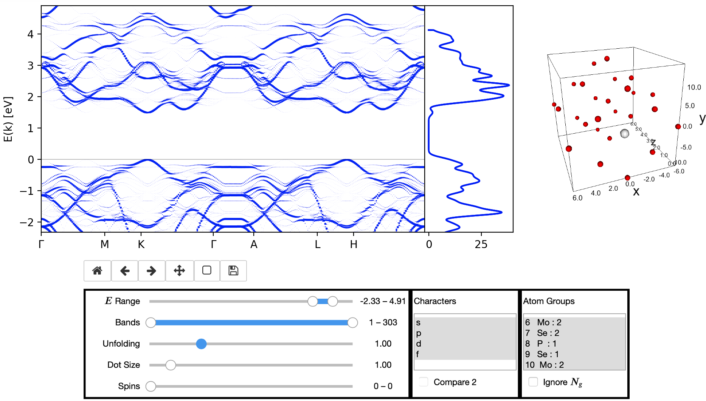

[](https://mybinder.org/v2/gh/JuDFTteam/masci-tools/studentproject18ws?filepath=studentproject18w%2Ffrontend%2Fjupyter%2Fdemo%2Fbinder_demo.ipynb)

SiScLab 2018 Student Project **Analysis Tool for Materials Design**. Written in Python3.

Authors: [Johannes Wasmer](https://github.com/Irratzo), [Christian Partmann](https://github.com/ChristianPartmann), and [Praneeth Katta](https://github.com/PraneethKatta).

<!-- markdown-toc start - Don't edit this section. Run M-x markdown-toc-refresh-toc -->
**Table of Contents**

- [Overview](#overview)
- [For Frontend Users](#for-frontend-users)
    - [General Remarks](#general-remarks)
        - [File Input](#file-input)
    - [Desktop Frontend](#desktop-frontend)
        - [Installation](#installation)
        - [Usage](#usage)
        - [Troubleshooting](#troubleshooting)
    - [Web Frontend](#web-frontend)
        - [Access](#access)
        - [Usage](#usage-1)
- [For Developers](#for-developers)
    - [Installation](#installation-1)
        - [Create project virtual environment](#create-project-virtual-environment)
    - [Programmatic use](#programmatic-use)
    - [Try out Web Frontend locally](#try-out-web-frontend-locally)
        - [If using Jupyter Notebook](#if-using-jupyter-notebook)
        - [If using Jupyter Lab](#if-using-jupyter-lab)
    - [Frontend Deployment](#frontend-deployment)
        - [Desktop Frontend](#desktop-frontend-1)
        - [Web Frontend](#web-frontend-1)
    - [Exending the code](#exending-the-code)
        - [Use Case: HDF with DOS data included](#use-case-hdf-with-dos-data-included)
        - [Extending the Visualization (Plots)](#extending-the-visualization-plots)

<!-- markdown-toc end -->


# Overview
This subfolder `studentproject18ws` is currently a largely independent side-project accompanying the main module `masci-tools`. It was created in a student project, and consists of three submodules:

  * preprocessor: a HDF reader interface, and one implementation for [Fleur](http://www.judft.de) band structure simulation output
  * visualization: a plotting interface, and one implementation for [Fleur](http://www.judft.de) bandstructure+DOS plots
  * frontends: a Desktop GUI and a Web Dashboard (Tk and Jupyter) for interactive Fleur bandDOS plots.

A more thorough description and example use cases can be found in the project [report](./doc/report.pdf) and [presentation](./doc/presentation.pdf). 



# For Frontend Users

## General Remarks

These remarks apply to all frontends.

Though the Desktop and Web Frontend are functionally identical, there might be small differences in how the controls are used and how they are labeled.  

### File Input

The frontends currently expects band structure data in the HDF output format of
[Fleur](http://www.judft.de). The density of states data is expected to be in
the CSV output format of [Fleur](http://www.judft.de), one file per spin. If no
density of states files are supplied, the frontend will just draw a band
structure plot (BandPlot) and omit the adjoined density of states plot
(DOSPlot). Thus, in the following BandDOSPlot stands for both kinds of plot. The
Web Frontend will only show controls for data that is present in the input
(e.g., DOS and spin controls).

## Desktop Frontend

### Installation

A windows executable file (.exe) is made by packing all the required packages
into the file. Any modern PC running on windows can run the frontend without any
installation process and there is no prerequisite to execute this executable
file. PC need not have python or other packages installed.

For executables for other operating systems, please contact the developers.

### Usage

Desktop based front end GUI is easy to use. By just running the .exe file provided will open the software with the packages involved to run the software. There are three tabs/windows in the software. In the first tab, absolute paths to the input data files must be entered in this order: HDF and (optional) DOS file for spin '0' and '1'.  

Controls for all plots: 

  * **Atom Groups**: draw the BandDOSPlot only for the selected symmetry groups.
  * **Character**: select one or more band Characters (orbitals) 'S','P','D','F'.
  * **Spin**: select any one spin or both spins.
  * **Marker size**: Default marker size of 1.0 is selected. How ever, user have a
    choice to increase the marker size of the dots (eigenenergies) plotted in
    the BandPlot.
  * **Ymin, Ymax**: This control is used to limit the range energy range of the BandDOSPlot.
  * **BandMin, BandMax**: This control is used to limit the band range of the BandDOSPlot.
  * **Update, SaveButton**: Update the BandDOSPlot to the newly selected data by user. Save the the plot as a PDF on disk.
  * **Exponential weight**: The unfolding exponent for supercell calculations (see [report](./doc/report.pdf)). Value 0.0 means no unfolding. If the calculation is done with a unit cell, this control has no effect.
  * **Compare 2Characters**: When a user wants to compare 2 characters, this button makes the BandPlot show the influence of each character to each eigenergy using a sequential (2) colormap. The control is disabled if other than two characters are selected.
  * **Ignore Atom group**: This button allows an option to ignore the atom groups.
  
Controls for the DOSPlot only:

  * **Select groups**: include selected atom groups in the DOS
  * **Interstitial**: include the interstitial in the DOS
  * **All characters**: include all characters in the DOS regardless of character selection. In the DOS CSV file, different input data is used (a summed column**.

After the Update button is clicked, a BandPlot or BandDOS plot is produced in Tab 2. A 3D atomic plot is produced in Tab 3. 

### Troubleshooting

If the BandPlot is not visible:

  * Click update two to three times.
  * Check if the three input files (if any) are belonging to the same Fleur calculation and selected appropriately.
  * Check if at least one Atom Group, one Character, one Spin is selected.
  * Check if Ymin is less than Ymax and similarly BandMin is less than BandMax such that software is able to plot.
  
If the DOSPlot is not visible:

  * Make sure either Select Groups or Interstitial is selected.

If the problem persists, try restarting the GUI. If that fails, please open an issue or contact the developers.

## Web Frontend

### Access

The Web Frontend is a Jupyter Dashboard. It is in experimental state (no fileupload yet). You can try it out on Binder [](https://mybinder.org/v2/gh/JuDFTteam/masci-tools/studentproject18ws?filepath=studentproject18w%2Ffrontend%2Fjupyter%2Fdemo%2Fbinder_demo.ipynb). You can run it locally (see developer section). If you have an [AiiDaLab account](https://aiidalab.materialscloud.org/hub/login**: the dashboard is planned to be published as an app there.

### Usage

Using the Dashboard should be self-explanatory to the domain user. Some tips:

   * if the plot window is not on startup or gets stuck, reload/rerun once.
   * unlike the Desktop frontend, plot updates are instantaneous.
   * unlike the Desktop Frontend, empty selections are impossible.   
   * multi-selection boxes: use ctrl or shift to select multiple items. 
   * slider values can also be typed into the adjoining text box.
   * try out the zoom and pan tools below the plot, they're useful.

# For Developers

## Installation

### Create project virtual environment

With conda (recommended):
- [Install Anaconda (3 recommended)](https://www.anaconda.com/download)
- Install the environment `masci-stupro` with the necessary and recommended dependencies:
```bash
conda create -f environment.yml
source activate masci-stupro
```
With virtualenv (untested):
```bash
virtualenv masci-stupro
source masci-stupro/bin/activate
pip install -r requirements_pip.txt # install requirements
```

## Programmatic use

Though `masci-tools` is availabe via PyPI, there is currently no plan to integrate `studentproject18ws`. If you want to use it in your code, clone the repo, use it in an IDE, or append the path to your `sys.path`:

``` python
import sys
if path_repo not in sys.path:
    sys.path.append(path_repo)
    
# now import works
from studentproject18w.hdf.reader import Reader
# ...
```

In this example, a Fleur HDF file is preprocessed using the Recipe `FleurBands`. The resulting output `data` with the extracted and transformed HDF datasets and attached load methods (Extract-Transform-Load) is then passed to a plotter, alongside some DOS CSV files for a bandstructure plot using `matplotlib` as backend library.

``` python
import matplotlib.pyplot as plt
from studentproject18w.hdf.reader import Reader
from studentproject18w.hdf.recipes import Recipes
from studentproject18w.plot.matplot import BandDOSPlot

data = None
reader = Reader(filepath=filepath_hdf)
with reader as h5file:
    data = reader.read(recipe=Recipes.FleurBands)
    #
    # Note:
    # Inside the with statement (context manager),
    # all data attributes that are type h5py Dataset are available (in-file access)
    # When the statement is left,the HDF5 file gets closed and the datasets are closed.
    #
    # Use data outside the with-statement (in-memory access: all HDF5 datasets converted to numpy ndarrays):
    data.move_datasets_to_memory()

plotter = BandDOSPlot(plt, data, filepaths_dos)
(fig, ax_bands, ax_dos) = plter.setup_figure(fig_ratio=[12,6], fig_scale=1, fig_title="BandDOS")
data_selection = some_selection_process()
plotter.plot_bandDOS(*data_selection)
plt.show()
```

## Try out Web Frontend locally

The demo notebook with the Dashboard is `studentproject18w/frontend/jupyter/demo/demo.ipynb`.

### If using Jupyter Notebook
If using Windows, omit keyword `source`.
```bash
source activate masci-stupro
cd mypath/masci-tools/studentproject18ws/
jupyter-notebook .
# if Home is not set to this dir, try this instead:
# /home/you/anaconda3/envs/myenv/bin/python /home/you/anaconda3/envs/myenv/bin/jupyter-notebook .
```
### If using Jupyter Lab
Additional installation step needed:
```bash
source activate masci-stupro
jupyter labextension install @jupyter-widgets/jupyterlab-manager jupyter-matplotlib ipyvolume
cd mypath/masci-tools/studentproject18ws/
jupyter-lab
```

## Frontend Deployment

### Desktop Frontend

To create executables for different operating systems, use
[PyInstaller](https://www.pyinstaller.org/). The target file is
`frontend/tkinter/gui.py`.


### Web Frontend

The Web Frontend is currently a single Jupyter Notebook. In order to publish it
as a usable standalone app, additional work has to be done.

  * (recommended: create `frontend/jupyter/Dashboard.py` widget and put code of [demo_back.ipynb](./frontend/jupyter/demo/demo_backend.ipynb) notebook inside it. Use [aiidalab-widgets-base > StructureUploadWidget](https://github.com/aiidalab/aiidalab-widgets-base/blob/master/aiidalab_widgets_base/structures.py) as a template. Create `frontend/jupyter/Dashboard.ipynb` notebook. Use [StructureUploadWidget Demo Notebook](https://github.com/aiidalab/aiidalab-widgets-base/blob/master/structures.ipynb) as a template.)
  * Add [fileupload](https://pypi.org/project/fileupload/) to widget (again, like in StructureUploadWidget. See [binder_fileupload_test.ipynb](./frontend/jupyter/demo/binder_fileupload_test.ipynb) notebook for a demo that works with binder.)
  * Now the Web Frontend should work on Binder.
  * For publishing the app on AiiDA Lab, the app has to be registered in the [aiidalab-registry](https://github.com/aiidalab/aiidalab-registry).
    * The project code is in Python3, but aiidalab requires Python2. So the code has to first be backported by hand using the `future` package. If this takes too long, maybe try the tool [3to2](https://pypi.org/project/3to2/).
    * Use the simplest app in the registry, [aiidalab-units](https://github.com/aiidalab/aiidalab-units) as a template. Adapt code.
    * Try it out first in the [Quantum Mobile Virtual Machine](https://www.materialscloud.org/work/quantum-mobile), which has aiidalab installed and configured. Else try it in a virtual environment with [aiidalab](https://pypi.org/project/aiidalab/) installed from PyPI.
    * Register the app.
    
Note: other publishing options besides Binder and AiiDALab are listed [here](https://github.com/markusschanta/awesome-jupyter). For instance, [Google Colaboratory](http://colab.research.google.com/) is a free Notebook hosting service that allows file upload.


## Extending the code

### Use Case: HDF with DOS data included

The Fleur output HDF format is expected to change and incorporate more data. In
turn, this project's code has to be extended as well. The procedure is outlined for a
an example use case: the incorporation of DOS data into the band structure HDF
(thus eliminating the need for separate DOS CSV files). The instructions show
how to extend the preprocessor, the visualization and frontend submodules to
that scenarion.

  * Add a new output type to `hdf/output_types`, say `FleurBandDOS`. Let it
    inherit from output type `FleurBands`. If you want an output type just for
    the DOS as well, add a type `FleurDOS` and let `FleurBandDOS` inherit it.
  * Add a new recipe to `hdf/recipes` e.g. `FleurBandDOS`. Copy unchanged things
    from recipe `FleurBands`.
  * If needed, add new transforms to `hdf/input_transforms`. Adhere to the
    transform function standard there. If there are mutual dependencies, add
    them to the list in the top of the file.
  * Add a DOS data selection method to the output type `FleurBands`. The
    `DOSPlot` in `plot/base` types will need those to plot the DOS plot. Simply
    adapt from the function in `dos/reader` for the DOS CSV files, adopt the
    identical signature.
  * In the `DOSPlot` types in submodule `plot`, add a switch to the constructor
    that can distinguish the three cases (bands, bands+CSV DOS, bands+HDF DOS).
    Use the switch in the `plotDOS` methods, and for the case bands+HDF DOS, call
    your new `FleurBandDOS` function.

### Extending the Visualization (Plots)

   * In addition to the inheritance scheme based on Python `AbstractBaseClass`
     (ABC) detailed in the [report](./doc/report.pdf), the `Plot` types in
     `plot` have an additional facility that helps to keep the appearance of
     different Frontends synchronized: each type has an attribute `icdv` of type
     `InteractiveControlDisplayValues`. This is an ABC with the same inheritance
     as the application Plot types. For every plot control argument that an
     application type's Plot type exposes in it's methods' signatures, this
     attribute describes the parameters of the accompanying control widget in
     the Frontend text label, default values, value ranges, and so on. In the current code, only the Web Frontend uses this facility, so the labels in the Desktop Frontend differ slightly.  
   * It is worth pointing out that unlike other languages, Python does not
     enforce implemented abstract methods to have the same method signature.
     However, when a new implementation for a different plotting library/backend
     is added, it is recommended to adopt the `abstractmethod` signature. That
     way, changing the backend in a use case only requires to change the import.
   
## Open Issues

   * The `FleurBands` data selection method could be optimized even more by
     replacing *all* numerical operations with `numpy` routines.
   * Running the Frontends in a debugger or with a counter reveals: on a plot
     selection changes, the plot seems to be redrawn not once but several times.
     The cause could not be found so far.
   * In the Desktop Frontend, the Update Button has to be clicked several times.
   * In the Web Frontend, on startup, the plot is only visible after two loads/cell runs.   
